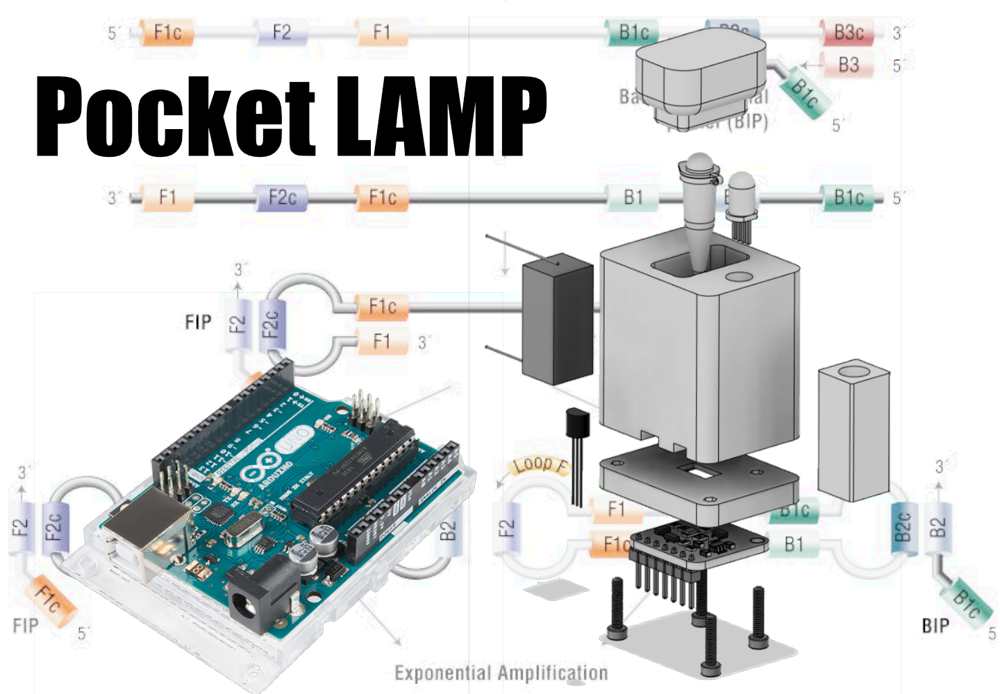

# POCKET-LAMP
PCR-LAMP Diagnostic Device

This is my entry for the The COVID-19 Detect & Protect Challenge

Here you will find the code, schematics and 3D model you need to build a COVID19 virus detector.

Read a full description at [Hackster.io](https://www.hackster.io/dnhkng/the-pocket-lamp-illuminating-sars-cov-2-3a1d17).
